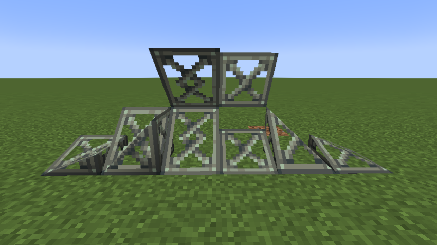

# Copycats+ Additions

Copycats+ Additions is a NeoForge addon for [Copycats+](https://modrinth.com/mod/copycats-plus)
that adds a set of new copycat block shapes — corner slopes, layered corner slopes, and
wall-mountable slope layers. Like every copycat block, each one can be skinned with almost any
block in the game, so you can match them to whatever you are building.

> **Note:** This mod was created with the help of AI.

## Blocks

| Block | Description |
|---|---|
| Copycat: Adv. Slope Layer | Slope layers that can also mount on vertical walls — place one against a wall for an in-wall variant. |
| Copycat Inner Corner Slope | Concave (inner) corner slope that fills the inside corner where two slopes meet. |
| Copycat Inner Corner Slope Layer | Layered version of the inner corner slope, stackable from 1 to 8 layers. |
| Copycat Corner Slope | Convex (outer) corner slope that caps the outside corner where two slopes meet. |
| Copycat Corner Slope Layer | Layered version of the outer corner slope, stackable from 1 to 8 layers. |

Every block is skinnable with any full block, just like the copycats you already know.

## Features

### Roof Texture Rotation

Corner slope blocks support **per-block roof texture rotation**. When you apply a uniform
material (such as planks) and right-click the block with the same material again, the sloped-face
UV projection rotates 90°, letting you choose whether the grain runs along the eave or up the
slope — independently on every placed block.

This rotation is saved in the blockstate, so it persists through world saves, multiplayer sync,
and Create contraption movement. The toggle can be disabled in the server config
(`enableExtraRotation`, default `true`).

## Installation

1. Install [NeoForge](https://neoforged.net/) for Minecraft 1.21.1.
2. Install the dependencies: [Copycats+](https://modrinth.com/mod/copycats-plus) and
   [Create](https://modrinth.com/mod/create).
3. Drop this mod's `.jar` into your `mods` folder.

## Requirements

- Minecraft 1.21.1
- NeoForge 21.1.x
- Copycats+ (latest for 1.21.1)
- Create 6.x

## License

MIT
